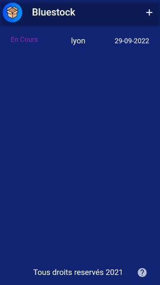
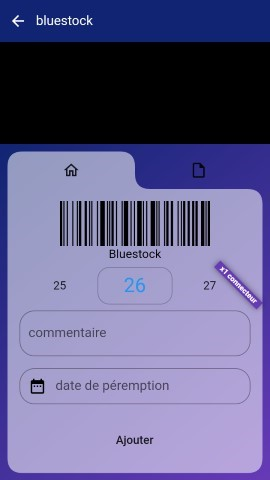

# Bluestock

Il s'agit d'une petite application d'inventaire créer selon les besoins et le cahier des charges du groupe Aural:
https://www.auralyon.org/fr/aural/presentation.html.

L'application prend en charge la lecture des code barres & code QR suivants:
Code128 (A - B - C) - Code39 - Code93 - itf - itf14 - itf16 - upcA - upcE - isbn - codabar - pdf417 - aztec - dataMatrix - qrCode

Lien playstore: https://play.google.com/store/apps/details?id=com.theme.bluestock


## Installation

```
Flutter 3.7.7 • channel stable • https://github.com/flutter/flutter.git
Framework • revision 2ad6cd72c0 (12 months ago) • 2023-03-08 09:41:59 -0800
Engine • revision 1837b5be5f
Tools • Dart 2.19.4 • DevTools 2.20.1
```

Pour compiler et lancer le project lancer les commande suivantes :
- `flutter clean`
- `flutter pub get`
- `flutter pub upgrade`
- `flutter run`

En mode Release il faudra remplir le fichier android/key.properties pour pouvoir compiler ou modifier la compilation du mode release.

Une fois lancer vous pourrez utiliser les fichier d'exemple pour tester l'application

## images de l'application







