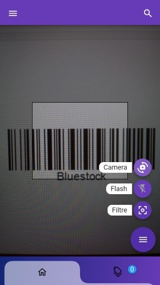
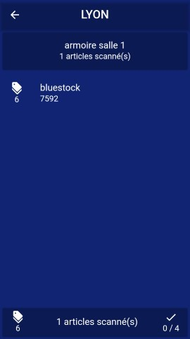

# Bluestock

Il s'agit d'une petite application d'inventaire créée selon les besoins et le cahier des charges du groupe Aural : [lien vers le groupe Aural](https://www.auralyon.org/fr/aural/presentation.html.
).

L'application prend en charge la lecture des codes-barres et des codes QR suivants :
Code128 (A - B - C) - Code39 - Code93 - ITF - ITF14 - ITF16 - UPC-A - UPC-E - ISBN - Codabar - PDF417 - Aztec - DataMatrix - QR Code

Lien Play Store : [lien vers Play Store](https://play.google.com/store/apps/details?id=com.theme.bluestoc)


## Installation

```
Flutter 3.7.7 • channel stable • https://github.com/flutter/flutter.git
Framework • revision 2ad6cd72c0 (12 months ago) • 2023-03-08 09:41:59 -0800
Engine • revision 1837b5be5f
Tools • Dart 2.19.4 • DevTools 2.20.1
```

Pour compiler et lancer le projet, lancez les commandes suivantes :
- `flutter clean`
- `flutter pub get`
- `flutter pub upgrade`
- `flutter run`

En mode Release, il faudra remplir le fichier android/key.properties pour pouvoir compiler ou modifier la compilation du mode Release.

Une fois lancée, vous pourrez utiliser les fichiers d'exemple pour tester l'application.

## images de l'application







